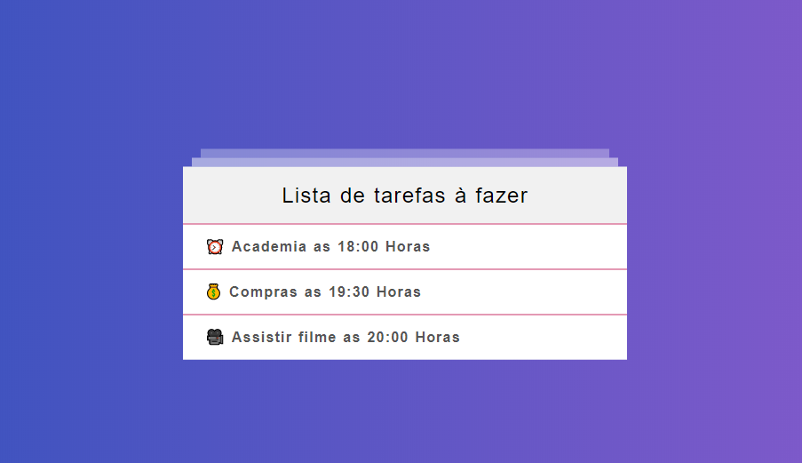

<h1 align="center">Welcome to To-do List 👋</h1>

    
  </a>

### 🏠 [Homepage](https://github.com/kessedias/TreinamentoReact)

## Run tests

npm run dev

## Author

* Github: [@kessedias](https://github.com/kessedias)

## 🤝 Contributing

Contributions, issues and feature requests are welcome! Feel free to check [issues page](https://github.com/kessedias/TreinamentoReact/issues). You can also take a look at the [contributing guide](https://github.com/kessedias/TreinamentoReact/blob/master/CONTRIBUTING.md).

***
_This README was generated with ❤️ by [readme-md-generator](https://github.com/kefranabg/readme-md-generator)_